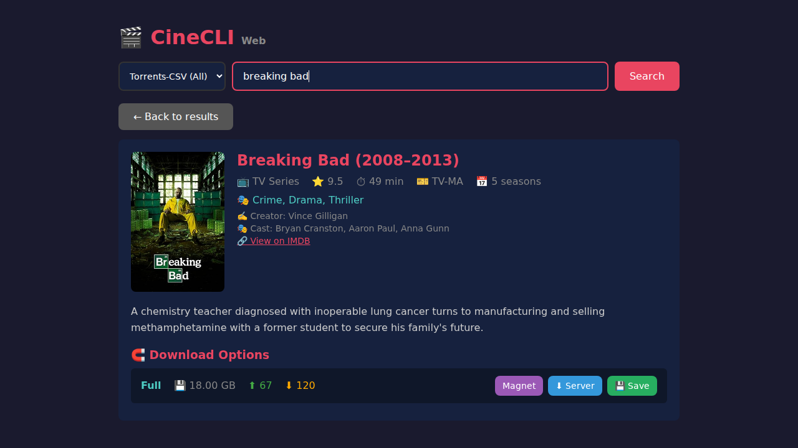

# 🎬 CineCLI Web

A web interface for browsing and downloading movies from YTS, with IMDB metadata enrichment.



## ✨ Features

- 🔍 **Multiple search sources:**
  - **YTS** - High quality movie torrents
  - **Torrents-CSV** - General torrents (movies, TV shows, and more)
- 🎥 View movie details with posters, ratings, cast, and plot (via OMDB/IMDB)
- 📊 Search results sorted by IMDB popularity
- 🧲 Generate magnet links (with copy to clipboard)
- ⬇ Download `.torrent` files to server
- 💾 Download `.torrent` files to your browser/computer
- 🎬 Click poster to open IMDB page

## 🚀 Usage

```bash
# Build
go build -o c-cli-web .

# Run with OMDB API key (recommended)
OMDB_API_KEY=your_key ./c-cli-web

# Run without OMDB (basic mode)
./c-cli-web
```

Then open http://localhost:8000

## ⚙️ Configuration

All configuration is via environment variables:

| Variable | Default | Description |
|----------|---------|-------------|
| `PORT` | `8000` | Server port |
| `HOST` | `127.0.0.1` | Bind address (use `0.0.0.0` for all interfaces) |
| `DOWNLOAD_DIR` | `$HOME` | Directory for server-side torrent downloads |
| `OMDB_API_KEY` | _(none)_ | OMDB API key for IMDB metadata ([get one free](https://www.omdbapi.com/apikey.aspx)) |

With OMDB enabled:
- Search results sorted by IMDB popularity (vote count)
- Returns up to 50 results (default)
- Full movie details: rating, runtime, director, cast, plot

### Example

```bash
PORT=3000 DOWNLOAD_DIR=/data/torrents OMDB_API_KEY=abc123 ./c-cli-web
```

## 📡 API Endpoints

| Endpoint | Description |
|----------|-------------|
| `GET /` | Web UI |
| `GET /api/search?q=<query>&source=<yts\|torrents-csv>` | Search movies/torrents |
| `GET /api/movie/<id>` | Get movie details (with OMDB data if configured) |
| `GET /api/magnet?hash=<hash>&name=<name>` | Generate magnet link |
| `GET /api/download?url=<url>&title=<title>&quality=<quality>` | Download .torrent to server |
| `GET /api/download-file?url=<url>&title=<title>&quality=<quality>` | Download .torrent to browser |
| `GET /api/save-magnet?infohash=<hash>&title=<title>` | Save magnet link to server (for torrents-csv) |

## 🛠 Tech Stack

- **Go** - No external web frameworks (stdlib only)
- **Embedded static files** - Single binary deployment
- **YTS API** - Movie and torrent data
- **OMDB API** - IMDB metadata (optional)

## 📄 License

Apache License 2.0 - see [LICENSE](../LICENSE) and [NOTICE](../NOTICE) for details.
